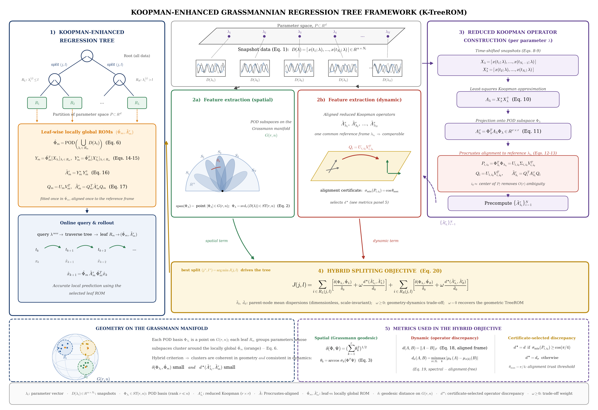
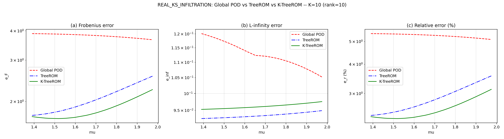
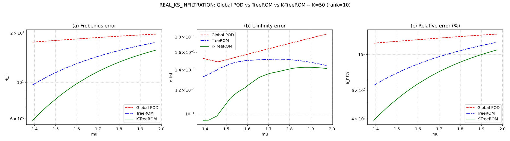
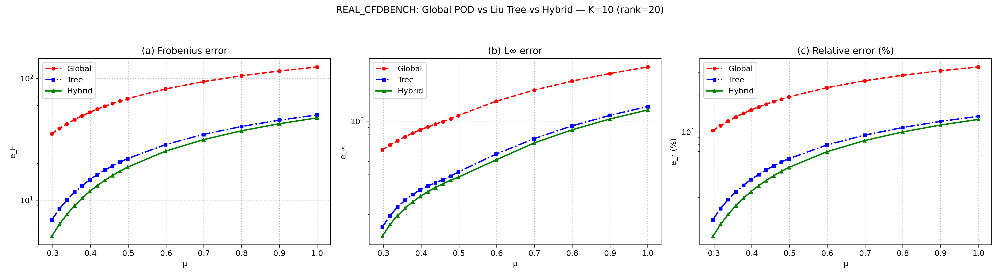

# Supplementary Results and Analysis

Companion to the main paper and to the theoretical guarantees in README file .

## Framework Overview

## Error Comparison Figures

### Richards Equation (REAL_KS_INFILTRATION), rank 10

**Rollout horizon K = 10:**

**Rollout horizon K = 50:**

### Cylinder Flow (REAL_CFDBENCH), rank 20, K = 10

## REAL_KS_INFILTRATION: Error Reductions

| Metric | Comparison | Absolute reduction (pp) | Relative error reduction |
|---|---|---:|---:|
| Projection | Global → TreeROM | 1.28 | 17.93% |
| Projection | Global → K-TreeROM | 1.70 | 23.81% |
| Projection | TreeROM → K-TreeROM | 0.42 | 7.17% |
| Rollout K=10 | Global → TreeROM | 2.41 | 45.56% |
| Rollout K=10 | Global → K-TreeROM | 2.70 | 51.04% |
| Rollout K=10 | TreeROM → K-TreeROM | 0.29 | 10.07% |
| Rollout K=50 | Global → TreeROM | 3.13 | 24.78% |
| Rollout K=50 | Global → K-TreeROM | 5.02 | 39.75% |
| Rollout K=50 | TreeROM → K-TreeROM | 1.89 | 19.89% |

### Trend

K-TreeROM is consistently the best model, and its advantage over TreeROM grows substantially with the rollout horizon: the relative error reduction over TreeROM increases from **10.07% at K=10 to 19.89% at K=50**, and the absolute gap widens from **0.29 pp to 1.89 pp**. Unlike the CFD case, TreeROM and K-TreeROM separate more as the rollout lengthens, indicating that the Koopman-enhanced component gives K-TreeROM better long-horizon dynamic stability for the infiltration problem.

*Qualification:* the selected trade-off weight changes from $\omega = 5$ at K=10 to $\omega = 1$ at K=50, so the two horizons use separately optimized K-TreeROM configurations.

## Choice of the Trade-off Weight $\omega$

Normalizing by parent-node dispersions in

$$\mathcal{J}(s) = \frac{g(s)}{\bar\delta_0} + \omega \frac{k(s)}{\bar d_0}$$

yields $\mathcal{O}(1)$ terms and a dimensionless weight $\omega$. Because the optimal split is selected from discrete candidates, the partitioning is piecewise-constant in $\omega$. A parameter sweep confirms $\omega = 0$ exactly recovers the geometric TreeROM. As $\omega$ increases, beyond a problem-dependent point the dynamical term dictates the ranking; in our examples the partitions and test errors saturate near $\omega \approx 5$. We report all results in this saturated regime.

## Note on Figure Rendering

The error curves connect discrete test cases sorted by $\mu$ with straight line segments (log-scale y-axes in panels (a) and (c)); no spline smoothing or interpolation is applied. Each plotted value corresponds to an actual held-out test case. The apparent smoothness reflects that infiltration solutions vary gradually with $K_s$, so neighboring parameter values — often falling in the same or adjacent tree leaves  have similar errors.
